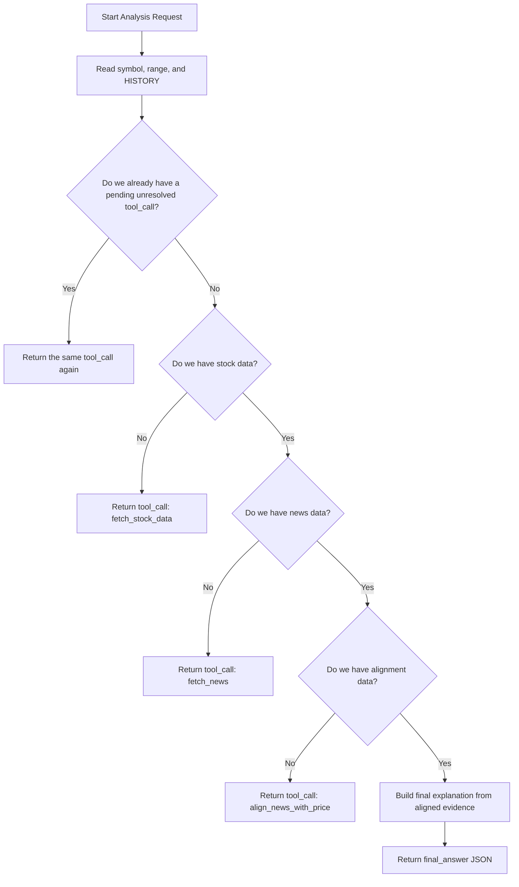
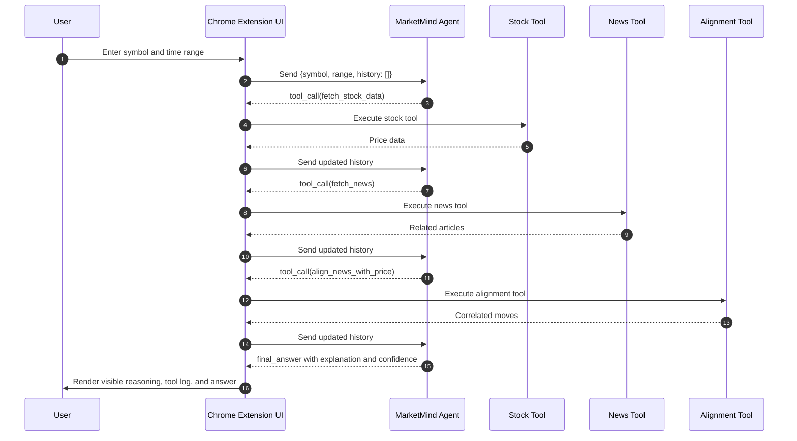
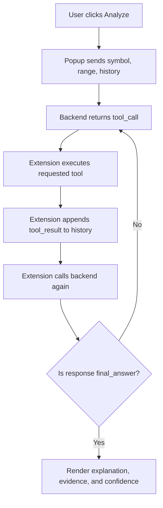

# MarketMind_AI

MarketMind AI is a Chrome extension driven by an agentic backend that explains why a stock moved by combining price action, related news, and a strict tool-based reasoning loop.

This repository currently contains the backend scaffold plus a Chrome extension popup scaffold for that workflow. The core agent logic is implemented, the popup UX is now in place, and the remaining work is wiring in the live data tools and API server.

## Overview

MarketMind AI is designed around one simple question:

**Why did this stock move?**

Instead of returning a vague summary, the agent follows a fixed sequence:

1. Fetch price data
2. Fetch relevant news
3. Align news with price movements
4. Generate a causal explanation backed by tool results

The backend is intentionally strict:

- it never returns a final answer before using tools
- it performs only one tool call at a time
- it uses prior history on every step
- it returns JSON-only responses for easy UI rendering
- it avoids unsupported claims when evidence is missing

## Current Status

Implemented in this repo:

- backend data models for stock, news, and alignment payloads
- backend response schemas for `tool_call`, `tool_result`, and `final_answer`
- system prompt builder with `HISTORY` injection
- a history-aware agent planner that enforces the required tool order
- a FastAPI backend with `/health`, `/analyze`, and `/tools/<tool_name>` endpoints
- deterministic demo tool execution so the extension can exercise Live mode locally

Not yet implemented in this repo:

- actual `fetch_stock_data` tool integration
- actual `fetch_news` tool integration
- actual `align_news_with_price` tool integration

Implemented frontend scaffold:

- Manifest V3 extension shell
- premium popup UI with preview and live mode states
- popup workflow timeline, evidence cards, confidence ring, and tool log
- local settings persistence for mode, ticker, range, and backend URL

## Repository Structure

```text
MarketMind_AI/
├── backend/
│   └── app/
│       ├── agent/
│       │   ├── marketmind_agent.py
│       │   └── prompt.py
│       └── models/
│           ├── data_models.py
│           └── schemas.py
│       ├── extension_api.py
│       └── services/
│           └── tool_service.py
├── extension/
│   ├── background.js
│   ├── manifest.json
│   ├── popup.html
│   ├── popup.js
│   └── styles.css
├── requirements.txt
├── .gitignore
└── README.md
```

## Core Files

- `backend/app/agent/marketmind_agent.py`
  Contains the `MarketMindAgent` class. This is the main stateful planner that decides the next valid step from the request history.

- `backend/app/agent/prompt.py`
  Stores the system prompt and builds the runtime prompt that includes the target stock and the full `HISTORY` block.

- `backend/app/models/data_models.py`
  Defines normalized Python dataclasses for price candles, news articles, aligned moves, and correlation payloads.

- `backend/app/models/schemas.py`
  Defines the JSON contract used by the backend and extension UI, including `tool_call` and `final_answer` response shapes.

- `backend/app/extension_api.py`
  Exposes the FastAPI application used by the extension in Live mode.

- `backend/app/services/tool_service.py`
  Runs the current demo implementations of the stock, news, and alignment tools.

## Agent Workflow

The agent follows a strict loop and will not skip steps.



## End-to-End Workflow

This is how the full system is expected to behave once the tools and frontend are connected.



## User Flow

The intended user experience inside the Chrome extension is shown below.

```mermaid
flowchart LR
    A[Open MarketMind Extension] --> B[Enter stock symbol]
    B --> C[Select date range]
    C --> D[Click Analyze]
    D --> E[Show tool progress state]
    E --> F[Show fetched price movement context]
    F --> G[Show matched news events]
    G --> H[Show final explanation]
    H --> I[Display confidence score]
    I --> J[Allow user to analyze another stock]
```



## Backend Response Contract

The backend is built to return JSON only.

### Tool step

```json
{
  "type": "tool_call",
  "thought": "Fetching stock data first so I can anchor the analysis to real price moves.",
  "tool": "fetch_stock_data",
  "input": {
    "symbol": "AAPL",
    "range": "5d"
  }
}
```

### Final step

```json
{
  "type": "final_answer",
  "thought": "I now have price data, news, and aligned evidence to explain the move.",
  "answer": "On 2026-04-24, AAPL moved up by 3.2% alongside news such as ...",
  "confidence": "85%"
}
```

## Request Shape

The current backend planner expects this input structure:

```json
{
  "symbol": "AAPL",
  "range": "5d",
  "history": []
}
```

As tools complete, the caller should append each result to `history` before asking the agent for the next step.

## Example History Progression

```json
[
  {
    "type": "tool_call",
    "thought": "Fetching stock data first so I can anchor the analysis to real price moves.",
    "tool": "fetch_stock_data",
    "input": {
      "symbol": "AAPL",
      "range": "5d"
    }
  },
  {
    "type": "tool_result",
    "tool": "fetch_stock_data",
    "output": {
      "symbol": "AAPL",
      "range": "5d",
      "prices": []
    }
  }
]
```

## Setup

### Prerequisites

- Python 3.11 or newer recommended
- `git`
- Google Chrome for extension testing

### Clone the project

```bash
git clone https://github.com/SairajMN/MarketMind_AI.git
cd MarketMind_AI
```

### Create a virtual environment

```bash
python3 -m venv .venv
source .venv/bin/activate
```

### Install dependencies

Install the backend dependencies:

```bash
pip install -r requirements.txt
```

## Running the Current Scaffold

This repo now includes a FastAPI server and packaged extension frontend scaffold.

### Smoke-test the backend modules

```bash
python3 -m compileall backend
```

### Run the FastAPI server

```bash
uvicorn backend.app.extension_api:app --reload
```

The default local address is:

```text
http://127.0.0.1:8000
```

### Check the API

Open these in your browser after starting the server:

- `http://127.0.0.1:8000/health`
- `http://127.0.0.1:8000/docs`

### Optional interactive check

```bash
python3
```

Then run:

```python
from backend.app.agent.marketmind_agent import MarketMindAgent

agent = MarketMindAgent()
response = agent.next_step({"symbol": "AAPL", "range": "5d", "history": []})
print(response)
```

Expected result:

- the agent returns a `tool_call`
- the first tool is `fetch_stock_data`

### Optional API check with curl

```bash
curl -X POST http://127.0.0.1:8000/analyze \
  -H "Content-Type: application/json" \
  -d '{"symbol":"NVDA","range":"5d","history":[]}'
```

Expected result:

- the API returns a `tool_call`
- the first tool is `fetch_stock_data`

## Recommended Local Development Flow

If you are continuing this project, the next build steps should be:

1. Add tool implementations for stock, news, and alignment.
2. Add an API layer such as FastAPI around `MarketMindAgent`.
3. Replace the current demo tool service with real market/news providers.
4. Expand the live tool outputs with production-grade evidence formatting.

## Suggested API Shape

An API server is not yet included, but a practical endpoint would look like this:

- `POST /analyze`
- request body: `{ "symbol": "AAPL", "range": "5d", "history": [...] }`
- response body: one JSON object in either `tool_call` or `final_answer` format

This matches the current planner implementation in `backend/app/agent/marketmind_agent.py`.

### Current live-mode backend contract

- `POST /analyze`
  Returns either a `tool_call` or a `final_answer`
- `POST /tools/fetch_stock_data`
  Returns demo stock candles
- `POST /tools/fetch_news`
  Returns demo articles
- `POST /tools/align_news_with_price`
  Returns aligned demo move windows

## Chrome Extension Setup

The repo now includes an `extension/` folder with a polished popup scaffold. It supports:

- `Preview` mode for UI testing with clearly labeled synthetic sample data
- `Live` mode backed by the local FastAPI demo server
- visible workflow steps, evidence cards, and tool logs
- saved local settings for symbol, range, mode, and backend URL

### Extension files

```text
extension/
├── manifest.json
├── popup.html
├── popup.js
├── styles.css
└── background.js
```

### Current extension behavior

#### `manifest.json`

- use Manifest V3
- define a popup page
- store local popup settings
- allow localhost or secure backend access for live mode

#### `popup.html`

- renders the popup shell and premium visual layout
- includes the symbol input, range picker, mode switcher, evidence area, and tool log

#### `popup.js`

- drives preview mode end to end
- stores settings with `chrome.storage.local`
- runs the visible loop UI for tool calls, results, and final answer
- includes a future-ready live mode that expects `POST /analyze` and `POST /tools/<tool_name>`

#### `background.js`

- initializes default extension settings on install

## Load the Extension in Chrome

To load the extension now:

1. Open `chrome://extensions`
2. Turn on **Developer mode**
3. Click **Load unpacked**
4. Select your local `extension/` folder
5. Open the extension popup and test against your local backend

## Run Live Mode End To End

1. Activate your virtual environment
2. Install dependencies with `pip install -r requirements.txt`
3. Start the backend with `uvicorn backend.app.extension_api:app --reload`
4. Load the unpacked extension from the `extension/` directory
5. Open the popup
6. Switch from `Preview` to `Live`
7. Keep the backend URL as `http://127.0.0.1:8000`
8. Click `Run Live Analysis`

The popup will now call the FastAPI backend for `/analyze` and `/tools/<tool_name>` in sequence.

## Extension-to-Backend Integration Flow



## Development Notes

- the current backend planner is deterministic and state-driven
- the `HISTORY` block is central to continuity across loop iterations
- unresolved tool calls are intentionally not replaced until the matching tool result is provided
- the final answer is conservative when aligned evidence is missing

## Limitations

Right now this repo is a scaffold, not a full production app. That means:

- the FastAPI server currently returns deterministic demo data rather than live market data
- the news tool currently returns demo articles rather than provider-backed news
- the alignment service is still a local demo correlation layer
- the extension UI is production-shaped, but its live backend is still demo-backed

## Next Steps

To turn this scaffold into a working product, the most important next tasks are:

1. Replace the demo stock tool with a real market data provider
2. Replace the demo news tool with a real news provider
3. Improve the alignment logic with stronger ranking and causality signals
4. Add persistence, caching, and rate-limit handling
5. Add tests around the full tool-call cycle
6. Expand the popup with richer charts and article drilldowns
